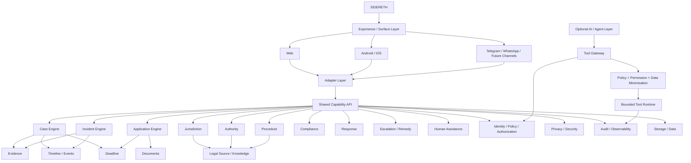

# SIDERETH — Estimate, Architecture Diagram & Figma/Wireframe Specification V1

## Status
Pre-implementation design baseline. This document is a planning estimate and UX prototype specification; it is not a claim that all listed components are implemented.

## 1. Engineering estimate
Planning estimates assume a senior product/platform team plus part-time legal, privacy, UX and SRE expertise.

| Workstream | Hours |
|---|---:|
| Foundation, architecture & contracts | 100–160 |
| Universal Case/Incident core | 220–340 |
| Evidence + document/provenance | 140–220 |
| Legal source + jurisdiction/authority/procedure/deadline | 180–280 |
| Security/privacy/audit/observability | 150–250 |
| Web MVP + core UX | 180–260 |
| Agent/tool infrastructure | 250–400 |
| Panchayat/Municipality adapters | 180–280 |
| Application Guardian | 100–160 |
| Protect Now | 140–220 |
| QA, hardening & release engineering | 150–250 |
| **Expanded first production-grade milestone** | **1,790–2,820** |

### Narrow MVP
A narrower deterministic MVP excluding the full agent platform and advanced Protect Now scope is approximately **900–1,300 hours**. This is the preferred first delivery target if speed is prioritized. The larger estimate is the realistic range for the broader production-grade milestone described by the current blueprint.

### Team model
Recommended core: 1 architecture/technical lead, 2 backend/platform engineers, 1 frontend engineer, 1 security/privacy engineer, 1 QA/automation engineer; part-time legal SME, UX/product, DevOps/SRE and privacy counsel.

## 2. System architecture diagram

### Architectural reading rule
The AI/agent layer is an optional augmentation layer. The legal source, case, evidence, deadline, policy and audit infrastructure remains authoritative and usable without generative AI.

## 3. Figma / wireframe prototype scope
Target: **18–25 screens**. The prototype must validate workflow correctness, information architecture, trust boundaries and approval gates before visual polish or production UI implementation.

### A. Global shell
1. Home
2. Sign-in / local profile or continue locally
3. Privacy & AI controls
4. Case switcher / dashboard

### B. PREPARE / CHECK
5. Prepare something
6. Select service/domain
7. Jurisdiction & authority
8. Eligibility/readiness
9. Document checklist
10. Readiness result
11. Submission record
12. Deadline tracker

### C. PROTECT NOW
13. Protect Now mode selection: Inspection / Search / Seizure / Raid / Questioning / Notice / Other
14. Identify authority/officer
15. Live Incident
16. Record event
17. Capture evidence
18. Incident timeline
19. Documents / items received or seized
20. Immediate guidance / verified sources
21. Human assistance

### D. UNDERSTAND / RESPOND / ESCALATE
22. Notice/document intake
23. Case overview / legal issues / evidence / deadlines
24. Response draft + human approval
25. Escalation/remedy

## 4. Wireframe specification

### Home
Primary cards:
- Prepare something
- Check compliance
- Something is happening now
- I received a notice
- Track an existing matter
- I need legal help

Secondary: recent matters, deadlines, privacy/AI status.

### Protect Now
Large, high-contrast action choices. No dense legal text. A persistent indicator shows: `Guidance: verified source / uncertainty / professional review`.

### Live Incident
Top: time, location, authority, officer. Main actions: `Record event`, `Capture evidence`, `Add document`, `View guidance`, `Get human help`. A safety banner states that the system does not advise obstructing lawful action.

### Case Overview
Sections: status, jurisdiction, authority, chronology, documents, evidence, legal issues, sources, deadlines, actions, response, escalation, audit history.

### Readiness
Each requirement has a state such as `Verified`, `Missing`, `Needs user input`, `Needs source verification`, `Professional review`.

### Response Review
Show source-backed propositions separately from user facts and drafted language. Submission remains disabled until required approval is explicitly recorded.

## 5. UX principles
- User problem first; legal terminology second.
- Progressive disclosure.
- Distinguish verified law, official procedure, user facts, inference and uncertainty.
- AI controls are explicit and optional.
- High-impact actions visibly require approval.
- Live mode prioritizes speed, readability and offline continuity.
- Evidence capture never depends on AI.
- Never imply guaranteed approval or legal outcome.

## 6. Prototype acceptance criteria
The prototype is accepted only if a reviewer can complete both journeys without ambiguity:

### Journey A
Home → Protect Now → event type → authority → live incident → guidance → record → evidence → timeline → documents → deadline → response → human assistance.

### Journey B
Home → Prepare → service → jurisdiction → eligibility → documents → readiness → submission record → deadline → decision → rejection/response/escalation.

The prototype must also demonstrate the difference between `user fact`, `verified legal source`, `inference`, `uncertainty`, and `professional review required`.
